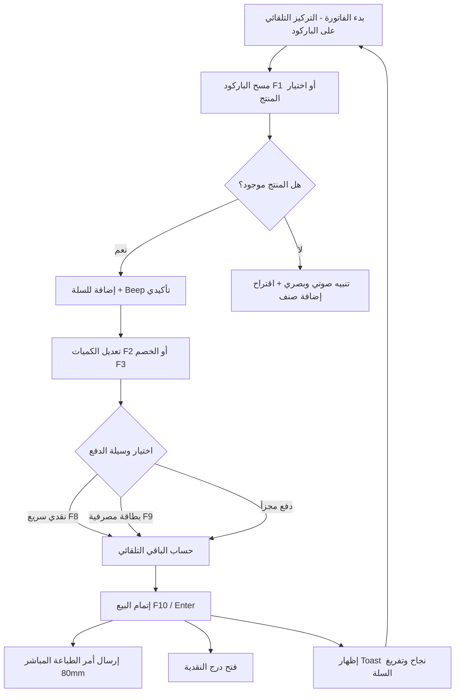

# 📊 التقرير الشامل لتحليل وتطوير طبقة سطح المكتب (Desktop Layer Analysis & UX Report)
**مشروع:** `RetalSystemAPI.Desktop` (نظام Emerald Management Pro)  
**التاريخ:** 25 أغسطس 2026  
**الحالة:** تقرير فني واستشاري شامل  

---

## 📑 فهرس التقرير
1. [المقدمة والتقييم المعماري للوضع الحالي](#1-المقدمة-والتقييم-المعماري-للوضع-الحالي)
2. [نقاط الاختناق والتحديات في تجربة المستخدم الحالية (Pain Points)](#2-نقاط-الاختناق-والتحديات-في-تجربة-المستخدم-الحالية)
3. [التحسينات الجوهرية لتجربة المستخدم (UX Enhancements)](#3-التحسينات-الجوهرية-لتجربة-المستخدم-ux-enhancements)
   - [أ. نقطة البيع السريعة المعتمدة بالكامل على لوحة المفاتيح (Keyboard-First POS)](#أ-نقطة-البيع-السريعة-المعتمدة-بالكامل-على-لوحة-المفاتيح)
   - [ب. نظام الإشعارات العائمة التفاعلي (Modern Toast Notifications)](#ب-نظام-الإشعارات-العائمة-التفاعلي)
   - [ج. لوحة تحكم حية ورسوم بيانية ذكية (Live Analytics & Dashboard)](#ج-لوحة-تحكم-حية-ورسوم-بيانية-ذكية)
   - [د. تجربة الجداول وتصدير البيانات (DataGrids & Power Filters)](#د-تجربة-الجداول-وتصدير-البيانات)
   - [هـ. محرك الثيمات (Dark Mode & Light Mode)](#هـ-محرك-الثيمات-dark-mode--light-mode)
4. [الميزات الوظيفية المقترح إضافتها (High-Value Feature Additions)](#4-الميزات-الوظيفية-المقترح-إضافتها)
5. [المخططات الهيكلية ومسار العمل (Visual Architecture & Flowcharts)](#5-المخططات-الهيكلية-ومسار-العمل)
6. [مصفوفة الأولويات وخطة التطوير (Implementation Roadmap)](#6-مصفوفة-الأولويات-وخطة-التطوير)

---

## 1. المقدمة والتقييم المعماري للوضع الحالي

تمت مراجعة وتحليل كامل الطبقة الرسومية لسطح المكتب المكتوبة بتقنية **WPF (.NET 10)**. يتميز المشروع بأساس هندسي نظيف وقوي:

* **نمط التصميم (Architecture):** تطبيق سليم لنمط **MVVM** عبر مكتبة `CommunityToolkit.Mvvm` مع استخدام خصائص التوليد الآلي (`[ObservableProperty]`, `[RelayCommand]`).
* **حقن التبعيات (DI):** استخدام حاوية `Microsoft.Extensions.DependencyInjection` لتسجيل وإدارة دورة حياة الـ ViewModels و الـ Services.
* **الملاحة والخدمات:** بنية منفصلة للاتصال بالخادم `ApiClient` وإدارة جلسات المستخدم `AuthStateService`.

> [!NOTE]
> هذا الأساس المتين يجعل إضافة التحسينات والميزات التفاعلية الجديدة أمراً سلساً ومباشراً دون الحاجة لإعادة هيكلة المشروع من الصفر.

---

## 2. نقاط الاختناق والتحديات في تجربة المستخدم الحالية

```
┌────────────────────────────────────────────────────────────────────────┐
│                        تحديات تجربة المستخدم الحالية                   │
├────────────────────────────────┬───────────────────────────────────────┤
│ 1. الاعتماد المفرط على الفأرة   │ الكاشير يحتاج للنقر المتكرر بالفأرة   │
│ 2. عدم وجود طباعة حرارية تلقائية│ لا يوجد محرك طباعة إيصالات 80mm مباشر │
│ 3. رسائل تنبيه ثابتة وجافة    │ أخطاء ونجاح العمليات تظهر كنصوص عادية │
│ 4. بيانات Dashboard وهمية      │ أرقام ثابتة في الكود ولا توجد رسوم    │
│ 5. غياب التصدير للتقارير       │ الجداول تفتقر لأزرار Excel / PDF      │
│ 6. غياب الوضع الداكن (Dark)    │ التطبيق يدعم الوضع الفاتح فقط          │
└────────────────────────────────┴───────────────────────────────────────┘
```

---

## 3. التحسينات الجوهرية لتجربة المستخدم (UX Enhancements)

---

### أ. نقطة البيع السريعة المعتمدة بالكامل على لوحة المفاتيح
في بيئات البيع بالتجزئة ونقاط البيع السريعة (POS)، تُقاس كفاءة النظام بعدد الثواني المستغرقة لإنهاء الفاتورة.

#### 1. خريطة الاختصارات السريعة (Keyboard Hotkeys Map)

| المفتاح | الوظيفة | آلية العمل في الواجهة |
| :---: | :--- | :--- |
| <kbd>F1</kbd> | **مسح / بحث الباركود** | نقل مؤشر الكتابة فوراً لحقل الباركود وتحديد النص الموجود لتجهيزه للمسح |
| <kbd>F2</kbd> | **تعديل الكمية** | فتح حقل تعديل الكمية للصنف النشط حالياً في السلة |
| <kbd>F3</kbd> | **تطبيق خصم** | فتح حقل إدخال الخصم (مبلغ مباشر أو نسبة مئوية) |
| <kbd>F4</kbd> | **اختيار / إضافة عميل** | فتح نافذة البحث السريع عن عميل أو إنشاء عميل فوري جديد |
| <kbd>F5</kbd> | **تعليق الطلب (Hold)** | حفظ السلة مؤقتاً لخدمة زبون آخر |
| <kbd>F6</kbd> | **استعادة الطلب المعلق** | استرجاع السلة المعلقة بضغطة زر واحدة |
| <kbd>F8</kbd> | **دفع نقدي تماماً (Exact Cash)** | وضع المبلغ المستلم مساوياً لإجمالي الفاتورة وتجهيز الإغلاق |
| <kbd>F9</kbd> | **دفع بالبطاقة المصرفية** | تحويل طريقة الدفع تلقائياً إلى بطاقة |
| <kbd>F10</kbd> / <kbd>NumPad Enter</kbd> | **إتمام البيع والطباعة** | حفظ الفاتورة وإرسال أمر الطباعة المباشر إلى الطابعة الحرارية |
| <kbd>F11</kbd> | **وضع ملء الشاشة (Kiosk)** | إخفاء شريط العنوان وقوائم الويندوز للتركيز في شاشة الكاشير |
| <kbd>Esc</kbd> | **إلغاء / إفراغ السلة** | إفراغ السلة بعد إظهار تنبيه تأكيدي سريع |

#### 2. ميزة التركيز التلقائي الدائم (Permanent Barcode Auto-Focus)
* إعادة مؤشر الفأرة تلقائياً إلى حقل إدخال الباركود بعد كل عملية (إضافة منتج، تعديل كمية، حذف صنف، أو إنهاء فاتورة)، مما يلغي حاجة الكاشير للمس الفأرة نهائياً.

#### 3. التغذية الصوتية التفاعلية (Haptic / Audio Feedback)
* تشغيل نغمة خفيفة وسريعة (Beep) عند قراءة باركود بنجاح.
* نغمة تحذير عند إدخال كود غير موجود أو نفاد كمية المخزون.
* نغمة إيجابية مبهجة عند إتمام عملية البيع بنجاح.

---

### ب. نظام الإشعارات العائمة التفاعلي (Modern Toast Notifications)
* **المشكلة الحالية:** الأخطاء ورسائل النجاح تظهر كنصوص ثابتة أسفل الأزرار أو في صناديق حوار معطلة لواجهة المستخدم (Modal Dialogs).
* **الحل المقترح:** مكون إشعارات عائم منبثق أعلى يمين/وسط الشاشة:
  * رسائل ملونة بانسيابية وفقاً لنوع الحدث (أخضر للنجاح، أحمر للخطأ، أصفر للتنبيه، أزرق للمعلومات).
  * اختفاء تلقائي بعد 3.5 ثوانٍ مع شريط تقدم زمني متناقص.
  * إمكانية إضافة أزرار سريعة داخل الإشعار مثل: `[طباعة الإيصال]` أو `[عرض الفاتورة]`.

---

### ج. لوحة تحكم حية ورسوم بيانية ذكية (Live Analytics & Dashboard)
تحويل لوحة التحكم من واجهة ساكنة إلى مركز عمليات حي:
1. **بطاقات الإحصائيات الفورية (Real-time Metric Cards):**
   * إجمالي مبيعات اليوم (مع نسبة المقارنة بأمس).
   * إجمالي مشتريات اليوم.
   * صافي الأرباح اليومية التقديرية.
   * عدد الفواتير الصادرة اليوم ومتوسط قيمة الفاتورة.
2. **رادار النواقص والمخزون الحرج (Low Stock Radar):**
   * جدول تفاعلي للأصناف التي وصلت أو تجاوزت حد إعادة الطلب مع زر مباشر `[+ إصدار طلب شراء]`.
3. **رسوم بيانية تفاعلية (Interactive SkiaSharp Charts):**
   * منحنى بياني لتوزيع المبيعات خلال ساعات اليوم أو أيام الأسبوع.
   * رسم دائري (Donut Chart) لأكثر المنتجات مبيعاً وتوليداً للأرباح.

---

### د. تجربة الجداول وتصدير البيانات (DataGrids & Power Filters)
تحسين كل شاشات البيانات (فواتير المبيعات، المشتريات، المخزون، العملاء، الموردين):
* **تصدير بضغطة زر واحدة:** أزرار تصدير إلى Excel (xlsx) و PDF في أعلى كل جدول.
* **البحث المباشر مع التهدئة (Debounced Live Search):** التصفية اللحظية للبيانات بمجرد الكتابة بعد توقف 300ms دون الحاجة للضغط على زر "تحديث".
* **فلاتر زمنية سريعة:** قائمة منسدلة سريعة (اليوم، أمس، آخر 7 أيام، هذا الشهر، هذا العام، نطاق مخصص).
* **قوائم الكليك يمين (Context Menu):** خيارات سريعة عند النقر باليمين على أي صف (عرض التفاصيل، طباعة، نسخ رقم الفاتورة، إلغاء).

---

### هـ. محرك الثيمات (Dark Mode & Light Mode)
تفعيل محرك الألوان المحدد في وثيقة `design.md`:
* **Emerald Dark Mode:** خلفية داكنة فخمة (`#122017` / `#1F2937`) مع أزرار خضراء ساطعة (`#38E07B`) توفر راحة تامة لأعين الموظفين في الورديات الليلية.
* **Emerald Light Mode:** المظهر الفاتح العصري (`#F6F8F7` / `#FFFFFF`).
* إمكانية التبديل بضغطة زر وحفظ الثيم المفضل في إعدادات النظام للمستخدم.

---

## 4. الميزات الوظيفية المقترح إضافتها (High-Value Feature Additions)

### 1. محرك الطباعة الحرارية المباشر (Direct ESC/POS Thermal Printing)
* إرسال مباشر لأوامر الطباعة إلى طابعات الإيصالات (80mm / 58mm) مثل Epson و Xprinter دون المرور بحوار Windows Print Dialog.
* تنسيق إيصال حراري كامل:
  * شعار المحل / المقهى واسم الفرع.
  * رقم الفاتورة، التاريخ، واسم الكاشير.
  * جدول الأصناف (الاسم، الكمية، السعر، الإجمالي).
  * ملخص الحساب (المجموع، الخصم، الضريبة، المدفوع، الباقي).
  * رمز الاستجابة السريعة (QR Code) المتوافق مع المتطلبات المالية.

### 2. شاشة إعدادات الأجهزة والنظام (Hardware & Preferences Hub)
شاشة مخصصة لإدارة بيئة العمل:
* **إعدادات الطابعات:** تحديد طابعة الإيصالات، طابعة الفواتير A4، وتفعيل خيار "الطباعة التلقائية فور الحفظ".
* **درج النقدية (Cash Drawer):** تفعيل إرسال نبضة الفتح التلقائي عند الدفع النقدي.
* **موازين الباركود الإلكترونية:** فك تشفير الباركود المتغير الذي يحتوي على الوزن والسعر تلقائياً.
* **العملة والضريبة:** تعيين رمز العملة (`د.ل`) والنسبة الضريبية الافتراضية.

### 3. نظام الدفع المختلط / المجزأ (Split Payment Engine)
* إتاحة دفع قيمة الفاتورة بأكثر من وسيلة (مثال: فاتورة بقيمة 150 د.ل يُدفع منها 50 د.ل نقداً و 100 د.ل عبر بطاقة مصرفية/سداد).

### 4. القفل السريع للشاشة ورمز PIN (Quick Screen Lock)
* زر قفل سريع في الشريط العلوي لقفل واجهة البيع عند مغادرة الكاشير لمكانه مؤقتاً، مع إمكانية فتحها برمز سري من 4 أرقام (PIN Code) دون الحاجة لإعادة تسجيل الدخول الكامل وتنزيل البيانات مجدداً.

### 5. النوافذ السريعة للإضافة اللحظية (In-Context Quick Creation)
* زر سريع `[+ عميل جديد]` داخل شاشة البيع لإضافة عميل فوري برقم هاتفه فقط دون مقاطعة عملية البيع.
* زر سريع `[+ مورد جديد]` داخل شاشة المشتريات.

### 6. شاشة عرض العميل المزدوجة (Dual-Screen / Customer Display)
* دعم شاشة العرض الثانوية المقابلة للزبون لعرض سلة المشتريات لحظة بلحظة، الحساب الإجمالي، ورسائل الشكر الترويجية.

---

## 5. المخططات الهيكلية ومسار العمل

### مخطط دورة حياة عملية البيع السريعة في POS:



---

## 6. مصفوفة الأولويات وخطة التطوير

```
                       الأثر على المستخدم (User Impact)
                                     ▲
                                     │  [اختصارات لوحة المفاتيح F1-F12]
                                     │  [محرك الطباعة الحرارية 80mm]
           [الوضع الداكن Dark Mode]   │  [نظام الإشعارات العائمة Toasts]
           [لوحة التحكم والرسوم الحية]│  [التركيز التلقائي لمسح الباركود]
                                     │  [نافذة العميل السريعة الفورية]
   ──────────────────────────────────┼──────────────────────────────────►
                                     │                 سهولة التنفيذ
           [الدفع المجزأ Split Pay]   │  [تصدير الجداول Excel/PDF]
           [شاشة العرض المزدوجة]      │  [أصوات التفاعل Beep Audio]
           [شاشة إعدادات الأجهزة]     │  [القفل السريع بالـ PIN]
                                     │
```

---

### جدول الحزم الزمنية للتنفيذ (Phased Delivery):

| المرحلة | الحزمة البرمجية | الميزات المستهدفة |
| :--- | :--- | :--- |
| **المرحلة 1: تجربة الكاشير السريعة** | **POS Core UX** | 1. اختصارات لوحة المفاتيح <kbd>F1-F12</kbd> والشريط السفلي التفاعلي.<br>2. التركيز التلقائي الدائم على الباركود.<br>3. نظام الإشعارات العائمة (Toast Notifications).<br>4. المؤثرات الصوتية عند المسح والإتمام. |
| **المرحلة 2: الطباعة والتكامل** | **Printing & Modals** | 1. محرك الإيصالات الحرارية المباشرة (ESC/POS 80mm).<br>2. نافذة الإضافة السريعة للعملاء من الـ POS.<br>3. شاشة إعدادات الطابعات والدرج والباركود.<br>4. تصدير جداول المبيعات والمشتريات والمخزون إلى Excel/PDF. |
| **المرحلة 3: التحليلات والهوية** | **Analytics & Theme** | 1. ربط لوحة التحكم ببيانات حقيقية مع الرسوم البيانية التفاعلية.<br>2. محرك التبديل بين الوضعين الداكن والفاتح (Dark / Light Mode).<br>3. الدفع المجزأ والقفل السريع برمز PIN. |

---

> [!TIP]
> جميع هذه التوصيات مصممة لتتوافق مباشرة مع كود وهيكلية `RetalSystemAPI.Desktop` الحالية دون كسر أي من الخدمات القائمة.
