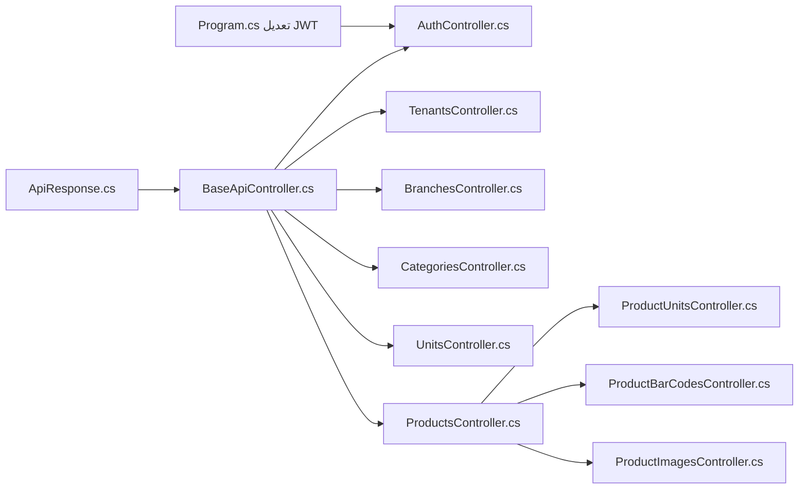

# خطة بناء طبقة المتحكمات (Controllers Layer) — النسخة النهائية ✅

## ✅ القرارات المعتمدة

| القرار | الاختيار |
|--------|----------|
| المصادقة | JWT محلي (استبدال AzureAD) |
| الصلاحيات | `[Authorize]` فقط الآن — الأدوار لاحقاً |
| التوثيق | بدون Swagger |
| التحقق من البيانات | `DataAnnotations` على الـ DTOs |

---

## 📋 نظرة عامة

طبقة الخدمات جاهزة بالكامل وتوفر عقداً واضحاً عبر `ServiceResult<T>` و `PagedResult<T>`. المهمة الآن هي بناء طبقة المتحكمات التي تحوّل هذه النتائج إلى استجابات HTTP منظمة ومتسقة.

---

## 📊 تحليل طبقة الخدمات الحالية

### الخدمات الموجودة

| الخدمة | الواجهة | العمليات |
|--------|----------|---------|
| `AuthService` | `IAuthService` | Login, Register, Logout |
| `TenantService` | `ITenantService` | GetById, GetAll, GetPaged, Create, Update, Delete, ToggleActive |
| `BranchService` | `IBranchService` | GetById, GetAll, GetPaged, Create, Update, Delete, ToggleActive |
| `CategoryService` | `ICategoryService` | GetById, GetAll, GetRoots, GetSubs, GetPaged, Create, Update, Delete, ToggleActive |
| `ProductService` | `IProductService` | GetById, GetPaged, Search, GetByBarCode, Create, Update, Delete |
| `UnitService` | `IUnitService` | GetById, GetAll, Create, Update, Delete |
| `ProductUnitService` | `IProductUnitService` | GetByProduct, AddUnit, RemoveUnit, SetDefault |
| `ProductBarCodeService` | `IProductBarCodeService` | GetByProduct, AddBarCode, RemoveBarCode |
| `ProductImageService` | `IProductImageService` | GetByProduct, AddImage, RemoveImage, SetDefault |
| `FileUploadService` | `IFileUploadService` | Upload, Delete (داخلي، لا يُكشف مباشرة) |

### نمط `ServiceResult<T>`
```csharp
// خدمة تعيد:
ServiceResult<T>      // مع بيانات
ServiceResult         // بدون بيانات
PagedResult<T>        // مع ترقيم الصفحات
```

### أكواد الأخطاء الموجودة
```
NOT_FOUND, UNAUTHORIZED, VALIDATION_ERROR, CONCURRENCY_ERROR
TENANT_NOT_FOUND, TENANT_NAME_EXISTS
INVALID_CREDENTIALS, USER_ALREADY_EXISTS
BRANCH_NOT_FOUND, BRANCH_NAME_EXISTS, BRANCH_HAS_ACTIVE_USERS
CATEGORY_NOT_FOUND, CATEGORY_HAS_PRODUCTS, CATEGORY_CIRCULAR_REFERENCE
PRODUCT_NOT_FOUND, UNIT_NOT_FOUND, PRODUCT_UNIT_NOT_FOUND
BARCODE_NOT_FOUND, IMAGE_NOT_FOUND, INVALID_FILE_TYPE, FILE_TOO_LARGE
```

---

## 🏗️ الهيكل المقترح للمتحكمات

```
RetalSystemAPI/
└── Controllers/
    ├── Base/
    │   └── BaseApiController.cs          # [NEW] متحكم أساسي مشترك
    ├── Auth/
    │   └── AuthController.cs             # [NEW] تسجيل الدخول والتسجيل
    ├── Tenants/
    │   └── TenantsController.cs          # [NEW] إدارة المستأجرين
    ├── Branches/
    │   └── BranchesController.cs         # [NEW] إدارة الفروع
    └── Catalog/
        ├── CategoriesController.cs       # [NEW] إدارة التصنيفات
        ├── ProductsController.cs         # [NEW] إدارة المنتجات
        ├── UnitsController.cs            # [NEW] إدارة وحدات القياس
        ├── ProductUnitsController.cs     # [NEW] وحدات المنتجات
        ├── ProductBarCodesController.cs  # [NEW] باركود المنتجات
        └── ProductImagesController.cs    # [NEW] صور المنتجات
```

إضافة إلى:
```
RetalSystemAPI/
├── Responses/
│   └── ApiResponse.cs                   # [NEW] غلاف موحد لاستجابات API
└── Extensions/
    └── ServiceResultExtensions.cs       # [NEW] تحويل ServiceResult → IActionResult
```

---

## 🔩 تفاصيل التنفيذ

### 1. `ApiResponse<T>` — غلاف الاستجابة الموحد

**المسار:** `RetalSystemAPI/Responses/ApiResponse.cs`

```csharp
public class ApiResponse<T>
{
    public bool Success { get; init; }
    public T? Data { get; init; }
    public string? Message { get; init; }
    public string? ErrorCode { get; init; }

    public static ApiResponse<T> Ok(T data, string? message = null) => ...;
    public static ApiResponse<T> Fail(string message, string? code = null) => ...;
}

public class ApiResponse
{
    public bool Success { get; init; }
    public string? Message { get; init; }
    public string? ErrorCode { get; init; }

    public static ApiResponse Ok(string? message = null) => ...;
    public static ApiResponse Fail(string message, string? code = null) => ...;
}
```

**الهدف:** إعادة استجابة JSON منسقة وموحدة لجميع نقاط النهاية.

---

### 2. `BaseApiController` — المتحكم الأساسي

**المسار:** `RetalSystemAPI/Controllers/Base/BaseApiController.cs`

```csharp
[ApiController]
[Route("api/[controller]")]
public abstract class BaseApiController : ControllerBase
{
    // تحويل ServiceResult<T> إلى IActionResult
    protected IActionResult ToActionResult<T>(ServiceResult<T> result) { ... }
    protected IActionResult ToActionResult(ServiceResult result) { ... }

    // تعيين كود HTTP حسب ErrorCode
    protected int GetStatusCode(string? errorCode) => errorCode switch
    {
        ErrorCodes.NotFound or *NotFound* => 404,
        ErrorCodes.Unauthorized => 401,
        ErrorCodes.ValidationError => 422,
        ErrorCodes.ConcurrencyError => 409,
        ErrorCodes.InvalidCredentials => 401,
        ErrorCodes.UserAlreadyExists => 409,
        _ => 400
    };
}
```

**القاعدة الذكية:** تعيين كود HTTP تلقائياً بناءً على `ErrorCode` من `ServiceResult`، بدلاً من تكرار الكود في كل متحكم.

---

### 3. `AuthController`

**المسار:** `Controllers/Auth/AuthController.cs`  
**المسار الأساسي:** `api/auth`  
**المصادقة:** ❌ لا مصادقة مطلوبة (مسموح للجميع)

| الفعل | المسار | الوصف |
|-------|--------|--------|
| `POST` | `api/auth/login` | تسجيل الدخول وإرجاع JWT |
| `POST` | `api/auth/register` | إنشاء حساب جديد |
| `POST` | `api/auth/logout` | تسجيل الخروج |

```csharp
[AllowAnonymous]
[HttpPost("login")]
public async Task<IActionResult> Login([FromBody] LoginDto dto, CancellationToken ct)
    => ToActionResult(await _authService.LoginAsync(dto, ct));
```

---

### 4. `TenantsController`

**المسار:** `Controllers/Tenants/TenantsController.cs`  
**المسار الأساسي:** `api/tenants`  
**المصادقة:** ✅ `[Authorize]` (يُنصح بـ Role=SuperAdmin مستقبلاً)

| الفعل | المسار | الوصف |
|-------|--------|--------|
| `GET` | `api/tenants` | قائمة كاملة |
| `GET` | `api/tenants/paged?page=1&size=10` | صفحية |
| `GET` | `api/tenants/{id}` | تفاصيل مستأجر |
| `POST` | `api/tenants` | إنشاء مستأجر |
| `PUT` | `api/tenants/{id}` | تعديل مستأجر |
| `DELETE` | `api/tenants/{id}` | حذف مستأجر |
| `PATCH` | `api/tenants/{id}/toggle-active` | تبديل حالة النشاط |

---

### 5. `BranchesController`

**المسار:** `Controllers/Branches/BranchesController.cs`  
**المسار الأساسي:** `api/branches`  
**المصادقة:** ✅ `[Authorize]`

| الفعل | المسار | الوصف |
|-------|--------|--------|
| `GET` | `api/branches` | قائمة الفروع |
| `GET` | `api/branches/paged?page=1&size=10` | صفحية |
| `GET` | `api/branches/{id}` | تفاصيل فرع مع الهواتف |
| `POST` | `api/branches` | إنشاء فرع |
| `PUT` | `api/branches/{id}` | تعديل فرع |
| `DELETE` | `api/branches/{id}` | حذف فرع (Soft Delete) |
| `PATCH` | `api/branches/{id}/toggle-active` | تبديل حالة النشاط |

---

### 6. `CategoriesController`

**المسار:** `Controllers/Catalog/CategoriesController.cs`  
**المسار الأساسي:** `api/catalog/categories`  
**المصادقة:** ✅ `[Authorize]`

| الفعل | المسار | الوصف |
|-------|--------|--------|
| `GET` | `api/catalog/categories` | جميع التصنيفات |
| `GET` | `api/catalog/categories/roots` | التصنيفات الجذرية |
| `GET` | `api/catalog/categories/{id}/children` | التصنيفات الفرعية |
| `GET` | `api/catalog/categories/paged?page=1&size=10` | صفحية |
| `GET` | `api/catalog/categories/{id}` | تفاصيل تصنيف |
| `POST` | `api/catalog/categories` | إنشاء تصنيف |
| `PUT` | `api/catalog/categories/{id}` | تعديل تصنيف |
| `DELETE` | `api/catalog/categories/{id}` | حذف تصنيف |
| `PATCH` | `api/catalog/categories/{id}/toggle-active` | تبديل حالة النشاط |

---

### 7. `UnitsController`

**المسار:** `Controllers/Catalog/UnitsController.cs`  
**المسار الأساسي:** `api/catalog/units`  
**المصادقة:** ✅ `[Authorize]`

| الفعل | المسار | الوصف |
|-------|--------|--------|
| `GET` | `api/catalog/units` | جميع وحدات القياس |
| `GET` | `api/catalog/units/{id}` | تفاصيل وحدة |
| `POST` | `api/catalog/units` | إنشاء وحدة |
| `PUT` | `api/catalog/units/{id}` | تعديل وحدة |
| `DELETE` | `api/catalog/units/{id}` | حذف وحدة |

---

### 8. `ProductsController`

**المسار:** `Controllers/Catalog/ProductsController.cs`  
**المسار الأساسي:** `api/catalog/products`  
**المصادقة:** ✅ `[Authorize]`

| الفعل | المسار | الوصف |
|-------|--------|--------|
| `GET` | `api/catalog/products/paged?page=1&size=10&categoryId=...` | قائمة صفحية |
| `GET` | `api/catalog/products/search?q=...` | بحث نصي |
| `GET` | `api/catalog/products/{id}` | تفاصيل منتج كاملة |
| `GET` | `api/catalog/products/by-barcode/{barCode}` | بحث بالباركود |
| `POST` | `api/catalog/products` | إنشاء منتج |
| `PUT` | `api/catalog/products/{id}` | تعديل منتج |
| `DELETE` | `api/catalog/products/{id}` | حذف منتج (Soft Delete) |

---

### 9. `ProductUnitsController`

**المسار:** `Controllers/Catalog/ProductUnitsController.cs`  
**المسار الأساسي:** `api/catalog/products/{productId}/units`  
**المصادقة:** ✅ `[Authorize]`

| الفعل | المسار | الوصف |
|-------|--------|--------|
| `GET` | `api/catalog/products/{productId}/units` | وحدات المنتج |
| `POST` | `api/catalog/products/{productId}/units` | إضافة وحدة للمنتج |
| `DELETE` | `api/catalog/products/{productId}/units/{productUnitId}` | إزالة وحدة |
| `PATCH` | `api/catalog/products/{productId}/units/{productUnitId}/set-default` | تعيين الوحدة الافتراضية |

---

### 10. `ProductBarCodesController`

**المسار:** `Controllers/Catalog/ProductBarCodesController.cs`  
**المسار الأساسي:** `api/catalog/products/{productId}/barcodes`  
**المصادقة:** ✅ `[Authorize]`

| الفعل | المسار | الوصف |
|-------|--------|--------|
| `GET` | `api/catalog/products/{productId}/barcodes` | بار كودات المنتج |
| `POST` | `api/catalog/products/{productId}/barcodes` | إضافة باركود |
| `DELETE` | `api/catalog/products/{productId}/barcodes/{barCodeId}` | حذف باركود |

---

### 11. `ProductImagesController`

**المسار:** `Controllers/Catalog/ProductImagesController.cs`  
**المسار الأساسي:** `api/catalog/products/{productId}/images`  
**المصادقة:** ✅ `[Authorize]`

| الفعل | المسار | الوصف |
|-------|--------|--------|
| `GET` | `api/catalog/products/{productId}/images` | صور المنتج |
| `POST` | `api/catalog/products/{productId}/images` | رفع صورة (`multipart/form-data`) |
| `DELETE` | `api/catalog/products/{productId}/images/{imageId}` | حذف صورة |
| `PATCH` | `api/catalog/products/{productId}/images/{imageId}/set-default` | تعيين الصورة الافتراضية |

> [!IMPORTANT]
> رفع الصور يستخدم `IFormFile` مع `multipart/form-data` وسيستدعي `IFileUploadService` داخلياً قبل استدعاء `IProductImageService`.

---

## 🔧 التغييرات في `Program.cs`

```csharp
// استبدال مصادقة AzureAd بـ JWT المحلي
builder.Services.AddAuthentication(JwtBearerDefaults.AuthenticationScheme)
    .AddJwtBearer(options =>
    {
        options.TokenValidationParameters = new TokenValidationParameters
        {
            ValidateIssuer = true,
            ValidateAudience = true,
            ValidateLifetime = true,
            ValidateIssuerSigningKey = true,
            ValidIssuer = builder.Configuration["JwtSettings:Issuer"],
            ValidAudience = builder.Configuration["JwtSettings:Audience"],
            IssuerSigningKey = new SymmetricSecurityKey(
                Encoding.UTF8.GetBytes(builder.Configuration["JwtSettings:Secret"]!))
        };
    });
```

> [!WARNING]
> الإعداد الحالي في `Program.cs` يستخدم **AzureAD** للمصادقة، لكن `AuthService` يولّد JWT محلي. **يجب استبدال إعداد المصادقة** ليعمل JWT المحلي بشكل صحيح مع المتحكمات.

---

## 🔧 تعديل `Program.cs` (JWT المحلي)

**استبدال إعداد AzureAD:**
```csharp
// قديم — حذفه
builder.Services.AddAuthentication(JwtBearerDefaults.AuthenticationScheme)
    .AddMicrosoftIdentityWebApi(builder.Configuration.GetSection("AzureAd"));
```

**بإعداد JWT المحلي:**
```csharp
builder.Services.AddAuthentication(JwtBearerDefaults.AuthenticationScheme)
    .AddJwtBearer(options =>
    {
        options.TokenValidationParameters = new TokenValidationParameters
        {
            ValidateIssuer = true,
            ValidateAudience = true,
            ValidateLifetime = true,
            ValidateIssuerSigningKey = true,
            ValidIssuer = builder.Configuration["JwtSettings:Issuer"],
            ValidAudience = builder.Configuration["JwtSettings:Audience"],
            IssuerSigningKey = new SymmetricSecurityKey(
                Encoding.UTF8.GetBytes(
                    builder.Configuration["JwtSettings:Secret"]!))
        };
    });
```

> [!WARNING]
> يجب إزالة حزمة `Microsoft.Identity.Web` من مرجع المشروع بعد الاستبدال.

---

## 📦 الملفات التي سيتم إنشاؤها

### [NEW] ملفات المتحكمات

| الملف | الحجم التقريبي |
|-------|---------------|
| `Responses/ApiResponse.cs` | ~40 سطراً |
| `Controllers/Base/BaseApiController.cs` | ~50 سطراً |
| `Controllers/Auth/AuthController.cs` | ~60 سطراً |
| `Controllers/Tenants/TenantsController.cs` | ~90 سطراً |
| `Controllers/Branches/BranchesController.cs` | ~90 سطراً |
| `Controllers/Catalog/CategoriesController.cs` | ~100 سطراً |
| `Controllers/Catalog/UnitsController.cs` | ~70 سطراً |
| `Controllers/Catalog/ProductsController.cs` | ~90 سطراً |
| `Controllers/Catalog/ProductUnitsController.cs` | ~70 سطراً |
| `Controllers/Catalog/ProductBarCodesController.cs` | ~60 سطراً |
| `Controllers/Catalog/ProductImagesController.cs` | ~80 سطراً |

### [MODIFY] الملفات المعدّلة

| الملف | التعديل |
|-------|---------|
| `Program.cs` | استبدال AzureAD بـ JWT البيئة المحلية |

---

## ✅ خطة التحقق

### اختبارات يدوية بعد الإنشاء
1. `POST /api/auth/register` → إنشاء مستخدم جديد وإرجاع JWT
2. `POST /api/auth/login` → تسجيل دخول وإرجاع JWT
3. `GET /api/tenants` مع Bearer Token → إرجاع القائمة
4. `POST /api/catalog/categories` → إنشاء تصنيف
5. `POST /api/catalog/products` → إنشاء منتج
6. `POST /api/catalog/products/{id}/images` → رفع صورة
7. اختبار الأخطاء: طلب كيان غير موجود → `404 Not Found` مع `errorCode`

### التحقق من البنية
- التأكد من أن جميع المتحكمات ترث من `BaseApiController`
- التأكد من أن `ToActionResult` يعيد أكواد HTTP الصحيحة
- التأكد من أن JWT يعمل في طلبات المصادقة

---

## 🗺️ خارطة طريق التنفيذ



**ترتيب التنفيذ:**
1. `ApiResponse.cs` + `BaseApiController.cs` (البنية التحتية)
2. تعديل `Program.cs` (JWT)
3. `AuthController.cs` (بوابة الدخول)
4. `TenantsController.cs` + `BranchesController.cs` (إدارة البنية)
5. `CategoriesController.cs` + `UnitsController.cs` (مرجعيات الكتالوج)
6. `ProductsController.cs` (الكيان الرئيسي)
7. `ProductUnitsController.cs` + `ProductBarCodesController.cs` + `ProductImagesController.cs` (ملحقات المنتج)
