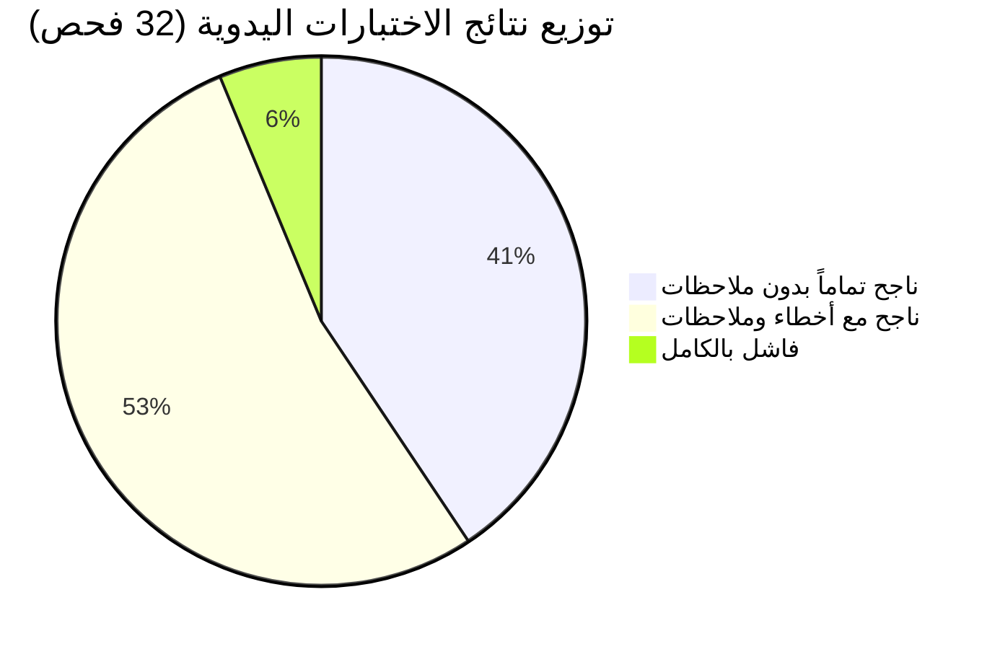
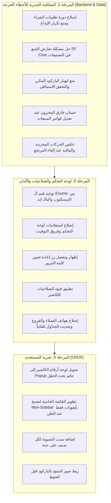

# 📑 التقرير التحليلي الشامل لنتائج الاختبار اليدوي
## نظام إدارة المبيعات والمخازن (Retal System Pro / Emerald Pro)

---

> [!NOTE]
> تم إعداد هذا التقرير بناءً على مراجعة دقيقة لنتائج الـ 32 اختباراً المنفذة في وثيقة الاختبار اليدوي، مع فحص عميق لسجلات الأخطاء (Exceptions)، وفحص الكود المصدري للـ Backend (ASP.NET Core / EF Core) والـ Frontend (WPF Desktop).

---

## 1. الملخص التنفيذي والإحصائي لنتائج الاختبار

| مؤشر التقييم | النتيجة | النسبة المئوية | الدلالة الفنية |
| :--- | :---: | :---: | :--- |
| **إجمالي حالات الاختبار المقررة** | **32** | 100% | تغطية شاملة لكافة وحدات ودورات النظام |
| **حالات ناجحة بالكامل (Full Pass)** | **13** | 40.6% | استقرار في دورات البيع السريع والتحويلات المخزنية وقواعد الإرجاع |
| **حالات نجحت مع ملاحظات أو أخطاء** | **17** | 53.1% | وظائف تبدو ناجحة ظاهرياً ولكنها تُخفي أخطاء منطقية أو استثناءات |
| **حالات فاشلة صراحة (Failed)** | **2** | 6.3% | (إعادة تعيين كلمة المرور + مؤشرات لوحة التحكم) |
| **مستوى الجاهزية الحالي للنشر** | — | **~55%** | **النظام بحاجة لمعالجة 5 مشاكل حرجة قبل إطلاقه للإنتاج** |



---

## 2. التحليل التفصيلي للأخطاء الحرجة (Critical Data & Server Bugs)

هذه الفئة من الأخطاء تمثل أولوية قصوى لأنها تُسبب تضخيماً وهمياً في المخزون، أو انهياراً في استجابة السيرفر (Unhandled 500 Exceptions).

---

### 🚨 الخلل 1: استقبال طلبيات الشراء وتكرار زيادة المخزون العشوائي (TC-PO-001)

#### 📝 تشخيص المشكلة:
- ذكر الفاحص في ملاحظاته:
  > *"عملية استقبال الطلبية خاطئة تماماً؛ يتم استقبالها بدون ربطها بمورد معين وبدون إنشاء فاتورة مشتريات. وثانياً: في كل مرة يتم الضغط على 'استلام' يتم تدوير حالة الطلبية، وفي كل مرة تصل لحالة 'مستلمة' يتم زيادة المخزون بشكل خاطئ ومتكرر!"*

#### 🔍 السبب الجذري في الكود:
1. **في الواجهة (Desktop)**:
   في الملف [PurchaseOrdersViewModel.cs](file:///c:/Users/Masoud/source/repos/RetalSystemAPI/RetalSystemAPI.Desktop/ViewModels/Purchase/PurchaseOrdersViewModel.cs#L178-L185):
   ```csharp
   // تدوير الحالة العشوائي عند الضغط
   PurchaseOrderStatus nextStatus = order.Status switch
   {
       PurchaseOrderStatus.Draft => PurchaseOrderStatus.Submitted,
       PurchaseOrderStatus.Submitted => PurchaseOrderStatus.Received,
       PurchaseOrderStatus.Received => PurchaseOrderStatus.Canceled,
       _ => PurchaseOrderStatus.Draft
   };
   ```
2. **في الـ Backend**:
   في الملف [PurchaseOrderService.cs](file:///c:/Users/Masoud/source/repos/RetalSystemAPI/RetalSystemAPI.Services/Purchase/Implementations/PurchaseOrderService.cs#L186-L230):
   كلما وصلت الحالة إلى `PurchaseOrderStatus.Received`، يتم البحث عن المخزون وزيادة الكميات:
   `stockToUpdate.Quantity += (int)item.Quantity;`
   وبسبب التدوير، عند النقر المتكرر تنتقل الحالة من ملغاة إلى مسودة إلى مستلمة مجدداً، مما يضاعف المخزون بدون أي قيد!
3. **غياب المورد وفاتورة الشراء**:
   شاشة إنشاء طلبية الشراء لا تتضمن حقلاً لاختيار المورد، كما أن استلام الطلبية يجب ألا يزيد المخزون كأمر منفصل، بل يجب إما تحويل الطلبية إلى فاتورة شراء رسمية (`PurchaseInvoice`) أو إقفالها نهائياً.

#### 💡 خطة الإصلاح:
- منع تدوير الحالات نهائياً؛ عند استلام الطلبية تتحول إلى `Received` وتقفل بشكل نهائي غير قابل للتدوير.
- إضافة زر "تحويل إلى فاتورة مشتريات" يولد فاتورة شراء رسمية ترتبط بالمورد وتثبت التكاليف والضرائب.
- إضافة خاصية منع التكرار (Idempotency): إذا كانت الطلبية قد استُلمت مسبقاً، يرفض السيرفر إعادة إضافة المخزون.

---

### 🚨 الخلل 2: انهيار تعديل التصنيف بـ Unhandled Exception في تتبع EF Core (TC-CAT-001)

#### 📝 تشخيص المشكلة:
- نجحت إضافة وحذف التصنيفات، ولكن عند محاولة تعديل اسم أو بيانات تصنيف حدث انهيار كامل:
  ```text
  System.InvalidOperationException: The instance of entity type 'Category' cannot be tracked 
  because another instance with the same key value for {'Id'} is already being tracked. 
  When attaching existing entities, ensure that only one entity instance with a given key value is attached.
     at RetalSystemAPI.DataAccess.Repositories.Implementations.Repository`1.Update(T entity)
     at RetalSystemAPI.Services.Catalog.Implementations.CategoryService.UpdateAsync(Guid id, UpdateCategoryDto dto)
  ```

#### 🔍 السبب الجذري في الكود:
- في الملف [CategoryService.cs](file:///c:/Users/Masoud/source/repos/RetalSystemAPI/RetalSystemAPI.Services/Catalog/Implementations/CategoryService.cs#L120-L145):
  ```csharp
  var category = await _unitOfWork.Categories.FirstOrDefaultAsync(new CategoryWithDetailsSpec(id), ct);
  // عند التحقق من الدائرية يتم جلب كيان آخر، أو أثناء المابينج:
  _mapper.Map(dto, category);
  _unitOfWork.Categories.Update(category); // <--- هنا المشكلة!
  ```
  دالة `Repository.Update` تقوم باستدعاء `_dbSet.Attach(entity)` أو تعيين حالته إلى `Modified`، بينما الكائن `category` تم جلبه أصلاً وهو قيد التتبع (Tracked). وجود أي كائن آخر محمل في شجرة الكيانات لنفس المعرف يسبب تصادم Identity Conflict فوري.

#### 💡 خطة الإصلاح:
- تعديل `CategoryService.UpdateAsync` للاعتماد على الكيان المحمل بالفعل وتعديل خصائصه دون استدعاء `Attach` مجدداً، أو جلب الكيان بـ `AsNoTracking()` قبل تحديثه، أو تعديل دالة `Repository.Update` لتتحقق مما إذا كان الكائن متتبعاً بالفعل في الـ ChangeTracker قبل محاولة إرفاقه.

---

### 🚨 الخلل 3: انهيار إضافة باركود مكرر بخطأ 500 بدلاً من إشعار خطأ مفهوم (TC-PRD-002)

#### 📝 تشخيص المشكلة:
- عند محاولة إدخال باركود مسجل مسبقاً لصنف آخر، حدث استثناء 500 من قاعدة البيانات:
  ```text
  Microsoft.Data.SqlClient.SqlException: Cannot insert duplicate key row in object 'dbo.ProductBarCodes' 
  with unique index 'IX_ProductBarCodes_TenantId_BarCode'.
  ```

#### 🔍 السبب الجذري في الكود:
- في الملف [ProductService.cs](file:///c:/Users/Masoud/source/repos/RetalSystemAPI/RetalSystemAPI.Services/Catalog/Implementations/ProductService.cs#L127-L138):
  يقوم الكود باستقبال الباركودات وحفظها مباشرة عبر `SaveChangesAsync()` دون عمل استعلام استباقي للتأكد من عدم وجود الباركود مسبقاً لدى المؤسسة (`TenantId`).

#### 💡 خطة الإصلاح:
- إضافة فحص استباقي في `ProductService`:
  ```csharp
  foreach (var bc in dto.BarCodes)
  {
      bool exists = await _unitOfWork.ProductBarCodes.ExistsAsync(b => b.BarCode == bc.BarCode, ct);
      if (exists)
      {
          return ServiceResult<ProductResponseDto>.Failure(
              $"الباركود '{bc.BarCode}' مسجل بالفعل لصنف آخر", ErrorCodes.BarCodeAlreadyExists);
      }
  }
  ```
- إضافة `try/catch` مخصص لـ `DbUpdateException` في طبقة الـ Controller لالتقاط انتهاكات الفهارس الفريدة وتحويلها إلى رسالة 400 Bad Request مفهومة.

---

### 🚨 الخلل 4: عدم احتساب فارق المخزون عند تعديل فواتير المبيعات (TC-SINV-001)

#### 📝 تشخيص المشكلة:
- الخصم من المخزون يتم بدقة عند إنشاء الفاتورة لأول مرة، لكن عند تعديل الفاتورة لاحقاً (بإضافة أصناف جديدة، أو تعديل كمية صنف بالزيادة أو النقصان، أو حذف بند) لا يتأثر رصيد المخزون إطلاقاً.

#### 🔍 السبب الجذري في الكود:
- في [SalesInvoiceService.cs](file:///c:/Users/Masoud/source/repos/RetalSystemAPI/RetalSystemAPI.Services/Sales/Implementations/SalesInvoiceService.cs):
  دالة `UpdateAsync` تقوم بتعديل بيانات الفاتورة وسطورها المالية دون حساب **الفارق التراكمي (Delta Stock)**:
  - إذا زادت الكمية من 2 إلى 5: يجب خصم 3 قطع إضافية من الصالة بعد التحقق من توفرها.
  - إذا نقصت الكمية من 5 إلى 2: يجب إرجاع 3 قطع إلى رصيد الصالة.
  - إذا حُذف بند بالكامل: يجب إعادة كامل كميته إلى رصيد الصالة.

#### 💡 خطة الإصلاح:
- بناء دالة `AdjustSalesInvoiceStockDeltaAsync` داخل `SalesInvoiceService` لحساب الفروقات بين البنود القديمة والجديدة وعكسها تلقائياً على `ShowroomStock`.

---

### 🚨 الخلل 5: عدم التراجع عن الحركات عند إلغاء مرتجع المبيعات (TC-SRET-001)

#### 📝 تشخيص المشكلة:
- عند إلغاء عملية إرجاع مبيعات سابقة، لا يتم التراجع عن الحركات المخزنية والمالية التي تسببت بها الفاتورة المرتجعة.

#### 🔍 السبب الجذري في الكود:
- عملية الإلغاء تكتفي بتعديل حالة السجل إلى `Cancelled`، دون وجود منطق يعيد خصم البضاعة التي دخلت المخزن، أو إعادة تعديل رصيد العميل أو الصندوق.

#### 💡 خطة الإصلاح:
- عند تحويل حالة المرتجع إلى `Cancelled`، يتم استدعاء حركة عكسية تخصم الكميات المرتجعة من المخزن وتلغي الأثر المالي من حساب العميل.

---

## 3. الأخطاء الوظيفية ومؤشرات لوحة التحكم (Major Functional Deficiencies)

---

### 📊 أ. لغز تعطل مؤشرات لوحة التحكم (TC-DSH-001)
أفاد الفاحص بأن: *"الشيء الوحيد الذي يعمل في الداشبورد هو إجمالي المشتريات!"*.
بعد التدقيق العميق في مسار البيانات بين الـ API والـ Desktop، اتضحت ثلاثة أسباب متضافرة:

1. **اختلاف قيم الترقيم (Enum Values Mismatch)**:
   - في الـ Backend:
     ```csharp
     public enum PaymentMethod { Cash = 1, BankTransfer = 2, CreditCard = 3, Credit = 4, Cheque = 5 }
     ```
   - في تطبيق الـ Desktop في [SalesInvoiceModels.cs](file:///c:/Users/Masoud/source/repos/RetalSystemAPI/RetalSystemAPI.Desktop/Models/Sales/SalesInvoiceModels.cs#L17-L24):
     ```csharp
     public enum PaymentMethod { Cash = 0, Card = 1, BankTransfer = 2, Credit = 3, Multiple = 4 }
     ```
   - النتيجة: عند قيام الكاشير بالبيع نقداً (Cash)، يرسل التطبيق قيمة `0` للسيرفر، في حين أن السيرفر يتوقع `1`!
2. **فارق التوقيت والـ UTC**:
   - استعلام مبيعات اليوم في [DashboardService.cs](file:///c:/Users/Masoud/source/repos/RetalSystemAPI/RetalSystemAPI.Services/Dashboard/Implementations/DashboardService.cs#L34-L59) يعتمد على:
     `var todayStart = DateTime.UtcNow.Date;`
     بينما الفواتير المسجلة بالتوقيت المحلي للجهاز (مثلاً UTC+2) قد تُحفظ بتوقيت لا يقع ضمن نطاق اليوم نفسه في توقيت الـ UTC.
3. **تجاهل مستودعات التخزين الرئيسية في رادار النواقص**:
   - استعلام الأصناف منخفضة المخزون يستعلم حصرياً من جدول `ShowroomStocks`، ويتجاهل جدول مستودعات التخزين `StorgeStocks` بالكامل.

---

### 🛡️ ب. أمان النظام وصلاحيات الأدوار (TC-AUTH-003 & TC-AUTH-004)
1. **غياب زر إعادة تعيين كلمة المرور في الواجهة (TC-AUTH-004)**:
   - نافذة `ResetPasswordWindow.xaml` تم تصميمها بالفعل، لكنها غير مربوطة بحدث النقر في جدول المستخدمين في `UsersView.xaml`.
2. **غياب قيود الصلاحيات للكاشير (TC-AUTH-003)**:
   - عند دخول مستخدم برتبة "كاشير"، تظل جميع شاشات الإدارة (المستخدمين، المؤسسة، الفروع، التسويات) متاحة أمامه دون حظر.
   - **الحل**: تفعيل دور الصلاحيات في `ShellViewModel`؛ بحيث لا يرى الكاشير إلا شاشة نقطة البيع (POS) وفواتير المبيعات الخاصة به.

---

### ⚠️ ج. عدم التحقق من الرصيد في فواتير المبيعات اليدوية (TC-SINV-002)
- التحقق من كفاية الرصيد مفعل ومحكم في شاشة الـ POS، ولكنه مفقود أو غير مشدد في شاشة إدخال فواتير المبيعات اليدوية `SalesInvoiceFormWindow`، مما سمح بطلب كميات تفوق رصيد الصالة.

---

## 4. مشاكل العرض والواجهة وربط البيانات (UI/UX & Data Binding)

1. **فشل إضافة/عرض أرقام الهواتف (TC-BRN-001 & TC-CUST-001)**:
   - إضافة هواتف الفروع تفشل بسبب عدم إرسال القائمة في الـ DTO بالشكل المتوقع، وأرقام هواتف العملاء لا تظهر في الجدول لعدم تضمينها عبر `.Include(c => c.Phones)` في استعلامات الواجهة.
2. **وميض شاشة الدخول وغياب رسائل الخطأ (TC-AUTH-002)**:
   - نافذة `LoginView` تُغلق وتفتح مجدداً عند الخطأ دون تمرير رسالة الخطأ المرتجعة من السيرفر لعرضها في نص تحذيري باللون الأحمر.
3. **تحديث الجداول بعد إغلاق النوافذ (TC-PINV-001)**:
   - إغلاق نافذة إنشاء فاتورة مشتريات لا يُطلق حدث تحديث القائمة التلقائي `LoadInvoicesCommand` في النافذة الأم.
4. **بطء الأداء بعد استيراد ملفات الإكسل (TC-PRD-003)**:
   - استيراد كميات كبيرة من الأصناف يحتاج إلى استخدام `AddRangeAsync` مع استدعاء واحد فقط لـ `SaveChangesAsync` بدلاً من الحفظ المتكرر لكل سطر، مما يضمن سرعة وسلاسة النظام.

---

## 5. طلبات تحسين تجربة المستخدم المحددة من قِبل الفاحص

### 1. لوحة الأرقام كـ Popup عائم بدلاً من Modal Dialog (TC-POS-002)
- **طلب الفاحص**:
  > *"لوحة الأرقام حالياً تظهر على شكل دايلوج، وأنا لا أريد هذا؛ أريدها أن تظهر على شكل نافذة عائمة تحت الكمية أو مربع السعر الذي يتم الضغط عليه"*.
- **الحل الفني**:
  تحويل نافذة `QuantityNumpadDialog` إلى عنصر `System.Windows.Controls.Primitives.Popup` عائم يرتبط بالـ DataGridCell المضغوطة، مع إغلاق تلقائي عند النقر خارجها (`StaysOpen="False"`).

### 2. القائمة الجانبية المصغرة Mini-Sidebar عند الطي (TC-UI-002)
- **طلب الفاحص**:
  > *"القائمة تعمل لكنها تطوى كلها؛ أنا أريد أن تبقى الأيقونات موجودة عندما تُطوى القائمة"*.
- **الحل الفني**:
  تعديل `SidebarColumn` في `ShellWindow.xaml`؛ بحيث يكون عرض القائمة الموسعة `Width="232"` وعند الطي يصبح `Width="64"` مع إخفاء النصوص وإبقاء الأيقونات ظاهرة ليظل التنقل سريعاً.

### 3. سبب التسوية الجردية على مستوى كل صنف (TC-ADJ-001)
- إضافة حقل اختيار السبب (`Damaged`, `Expired`, `InventoryCount`) في كل سطر في جدول التسويات بدلاً من حصره في الترويسة العامة للأمر فقط.

### 4. ربط صور المنتج بالباركود في الذاكرة المؤقتة قبل الحفظ (TC-PRD-001)
- جعل القائمة المنسدلة للباركودات في تبويب الصور تتغذى من قائمة الباركودات المدخلة حالياً في النافذة، دون اشتراط حفظها في قاعدة البيانات أولاً.

---

## 6. خارطة طريق العمل وخطة المعالجة المقترحة (Action Plan)



---

### 📁 روابط الوصول للملفات في بيئة العمل:
- **ملف وثيقة الاختبار الأصلية مع النتائج**: [RetalSystem_Manual_Testing_Document.md](file:///c:/Users/Masoud/source/repos/RetalSystemAPI/RetalSystem_Manual_Testing_Document.md)
- **ملف التقرير التحليلي الكامل**: [RetalSystem_Test_Analysis_Report.md](file:///c:/Users/Masoud/source/repos/RetalSystemAPI/RetalSystem_Test_Analysis_Report.md)
- **ملف التقرير في قسم المستندات (Artifact)**: [test_analysis_report.md](file:///C:/Users/Masoud/.gemini/antigravity-ide/brain/196f6e0c-2eac-492e-9b9f-83382c7a38c3/test_analysis_report.md)
