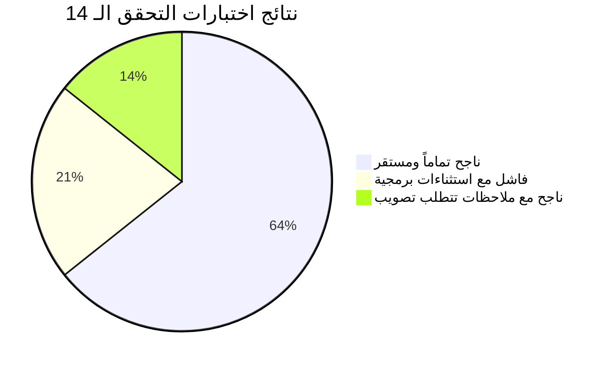

# 📑 التقرير التحليلي الشامل لنتائج اختبارات التحقق (Post-Fix Analysis)
## نظام إدارة المبيعات والمخازن — Retal System Pro

---

> [!NOTE]
> تم إعداد هذا التقرير بناءً على مراجعة دقيقة وموسعة لنتائج الفحوصات الـ 14 المنفذة في ملف [RetalSystem_Verification_Testing_Suite.md](file:///c:/Users/Masoud/source/repos/RetalSystemAPI/RetalSystem_Verification_Testing_Suite.md)، وفحص سجلات الاستثناءات المرفقة (EF Core Stack Traces)، ومراجعة الكود المصدري لسيرفر الـ Backend والـ Desktop.

---

## 1. الملخص التنفيذي والإحصائي للنتائج



| مؤشر التقييم | النتيجة | النسبة المئوية | الدلالة الفنية |
| :--- | :---: | :---: | :--- |
| **إجمالي حالات الاختبار** | **14** | 100% | تغطية لكافة التعديلات عبر المراحل الثلاث |
| **حالات ناجحة بالكامل (Pass)** | **9** | **64.3%** | استقرار التصنيفات، الباركود، لوحة التحكم، تعيين كلمة المرور، الكاشير، بوب-أب POS، القائمة الجانبية، وصور المنتج |
| **حالات ناجحة مع ملاحظات** | **2** | **14.3%** | طلبيات الشراء (TC-FIX-001) وأسباب التسوية الجردية (TC-FIX-013) |
| **حالات فاشلة صراحة (Fail)** | **3** | **21.4%** | تعديل/حذف المبيعات (TC-FIX-004)، حذف المرتجع (TC-FIX-005)، وهواتف العملاء (TC-FIX-009) |

---

## 2. التحليل الفني المفصل للأخطاء والاستثناءات

---

### 🚨 الخلل 1: انهيار تعديل وحذف فواتير المبيعات وحذف المرتجع (TC-FIX-004 & TC-FIX-005)

#### 📝 نص الخطأ المسجل:
```text
System.InvalidOperationException: The instance of entity type 'Warehouse' cannot be tracked 
because another instance with the same key value for {'Id'} is already being tracked. 
When attaching existing entities, ensure that only one entity instance with a given key value is attached.
   at Microsoft.EntityFrameworkCore.ChangeTracking.Internal.IdentityMap`1.ThrowIdentityConflict
   at Microsoft.EntityFrameworkCore.Internal.InternalDbSet`1.Attach(TEntity entity)
   at RetalSystemAPI.DataAccess.Repositories.Implementations.Repository`1.Update(T entity) in Repository.cs:line 243
   at RetalSystemAPI.Services.Sales.Implementations.SalesInvoiceService.UpdateAsync in SalesInvoiceService.cs:line 416
   at RetalSystemAPI.Services.Sales.Implementations.SalesInvoiceService.DeleteAsync in SalesInvoiceService.cs:line 521
   at RetalSystemAPI.Services.Sales.Implementations.SalesReturnService.DeleteAsync in SalesReturnService.cs:line 273
```

#### 🔍 التشخيص والسبب الجذري:
1. **جلب الفاتورة مفصولة عن التتبع (AsNoTracking)**:
   في [SalesInvoiceService.cs](file:///c:/Users/Masoud/source/repos/RetalSystemAPI/RetalSystemAPI.Services/Sales/Implementations/SalesInvoiceService.cs#L245)، يتم جلب الفاتورة عبر:
   ```csharp
   var invoice = await _unitOfWork.SalesInvoices.FirstOrDefaultAsync(new SalesInvoiceWithDetailsSpec(id), ct);
   ```
   دالة `FirstOrDefaultAsync` للمواصفات في [Repository.cs](file:///c:/Users/Masoud/source/repos/RetalSystemAPI/RetalSystemAPI.DataAccess/Repositories/Implementations/Repository.cs#L88-L91) تستدعي `AsNoTracking()`. 
   ونظراً لأن المواصفة `SalesInvoiceWithDetailsSpec` تحتوي على:
   ```csharp
   AddInclude(s => s.Warehouse);
   ```
   فإن الكيان `invoice.Warehouse` يتم تحميله ككائن منفصل (Detached Instance $W_1$).

2. **استعلام المستودع وفحص المخزون يولد نسخة متتبعة**:
   في السطر 256 من نفس الخدمة:
   ```csharp
   var warehouse = await _unitOfWork.Warehouses.GetByIdAsync(invoice.WarehouseId, ct);
   ```
   دالة `GetByIdAsync` تستخدم `_dbSet.FindAsync`، والتي تضع كائن المستودع تحت تتبع الـ ChangeTracker (ككائن متتبع $W_2$).

3. **تصادم الهوية (Identity Conflict)**:
   عند استدعاء `_unitOfWork.SalesInvoices.Update(invoice)` أو `SoftDelete(invoice)`:
   - نظراً لأن `invoice` غير متتبع، يدخل في فرع `_dbSet.Attach(invoice)`.
   - يقوم EF Core بفحص الشجرة المرتبطة بالفاتورة (Object Graph) ويحاول عمل Attach لـ `invoice.Warehouse` ($W_1$).
   - يجد الـ ChangeTracker أن هناك كائناً متتبعاً بالفعل ($W_2$) بنفس المعرف `Warehouse.Id`!
   - ينهار السيرفر فوراً بـ `InvalidOperationException` دون حفظ أي تعديلات.

4. **الحل الجذري**:
   - استخدام `FirstOrDefaultTrackedAsync` لجلب الفاتورة متتبعة مباشرة في `UpdateAsync` و `DeleteAsync`.
   - الاعتماد على `invoice.Warehouse` المحمّل بالفعل بدلاً من إعادة استعلامه بـ `GetByIdAsync`.
   - قطع شجرة الكائنات المرتبطة غير المرغوب في تتبعها (`invoice.Warehouse = null; invoice.Branch = null; invoice.Customer = null;`) قبل الحفظ إذا لزم الأمر، وتحديث خصائص الكيان المتتبع مباشرة مع استدعاء `_unitOfWork.SaveChangesAsync`.
   - تطبيق نفس الإجراء الحاسم في [SalesReturnService.cs](file:///c:/Users/Masoud/source/repos/RetalSystemAPI/RetalSystemAPI.Services/Sales/Implementations/SalesReturnService.cs).

---

### 🚨 الخلل 2: اختفاء وحذف أرقام هواتف العملاء (TC-FIX-009)

#### 📝 ملاحظة المختبر:
> *"اضافة ارقام الهاتف في العملاء كانت تعمل.. اما الأن لا الأضافة تعمل ولا العرض يعمل.. الكود الموجد حاليا يقوم بحدف كل البياانتا من جدول هواتق العملاء"*

#### 🔍 التشخيص والسبب الجذري:
1. **اختلاف تسمية الخاصية بين الـ API والـ Desktop (JSON Serialization Mismatch)**:
   - السيرفر في [CustomerResponseDto.cs](file:///c:/Users/Masoud/source/repos/RetalSystemAPI/RetalSystemAPI.Models.DTOs/Customers/CustomerResponseDto.cs#L17) يُرجع قائمة الهواتف باسم `Phones`:
     ```csharp
     public List<CustomerPhoneResponseDto> Phones { get; set; } = new();
     ```
   - تطبيق الديسكتوب في [CustomerModels.cs](file:///c:/Users/Masoud/source/repos/RetalSystemAPI/RetalSystemAPI.Desktop/Models/Customers/CustomerModels.cs#L33) كان يتوقع الخاصية باسم `CustomerPhones`:
     ```csharp
     public List<CustomerPhoneDto> CustomerPhones { get; set; } = new();
     ```
   - النتيجة: عند جلب تفاصيل العميل، يفشل الـ JSON Deserializer في التعرف على الخاصية، فتكون القائمة `Phones` في شاشات الديسكتوب **فارغة دائماً**!

2. **المسح التلقائي للبيانات عند الحفظ**:
   - عندما يفتح المستخدم شاشة تعديل العميل أو يحفظ بياناته في [CustomersViewModel.cs](file:///c:/Users/Masoud/source/repos/RetalSystemAPI/RetalSystemAPI.Desktop/ViewModels/Customers/CustomersViewModel.cs#L381)، يتم إرسال القائمة الفارغة `Phones = []` إلى السيرفر.
   - في السيرفر في [CustomerService.cs](file:///c:/Users/Masoud/source/repos/RetalSystemAPI/RetalSystemAPI.Services/Customers/Implementations/CustomerService.cs#L127-L135):
     ```csharp
     if (dto.Phones != null)
     {
         foreach (var phone in customer.CustomerPhones.ToList())
         {
             _unitOfWork.CustomerPhones.HardDelete(phone); // يقوم بحذف كافة أرقام الهواتف!
         }
     }
     ```
   - النتيجة: كلما تم فتح العميل وحفظه، تُحذف جميع هواتفه المسجلة نهائياً من قاعدة البيانات!

3. **الحل الجذري**:
   - في الديسكتوب [CustomerModels.cs](file:///c:/Users/Masoud/source/repos/RetalSystemAPI/RetalSystemAPI.Desktop/Models/Customers/CustomerModels.cs): توحيد الخاصية لتكون `Phones` مع إضافة `[JsonPropertyName("phones")]`، والإبقاء على خاصية بديلة للتوافق.
   - في السيرفر [CustomerService.cs](file:///c:/Users/Masoud/source/repos/RetalSystemAPI/RetalSystemAPI.Services/Customers/Implementations/CustomerService.cs): حماية بيانات الهواتف؛ بحيث لا يتم حذف الهواتف القديمة إذا كانت القائمة المرسلة فارغة إلا إذا طلب المستخدم صراحة حذف هاتف معين، مع دعم الإضافة التراكمية.

---

### 💡 الملاحظة 3: دورة طلبيات الشراء وفواتير المشتريات (TC-FIX-001)

#### 📝 ملاحظة المختبر:
> *"نجاح لكن الربط بالمورد اصبح اجباري و هناك بعض الفواتير تكون عامة لدلك يجب منع الاستلام في حالة عدم ربطها بالمورد و هكدا يصبح الربط غير اجباري، تانياً لا يتم اضافة فاتورة مشتريات و بنودها"*

#### 🔍 التشخيص والحل:
1. **جعل المورد اختيارياً عند الإنشاء**:
   - تعديل `SupplierId` في نماذج إنشاء وتعديل طلبية الشراء (`CreatePurchaseOrderDto`, `UpdatePurchaseOrderDto`) ليكون اختيارياً (`Guid? SupplierId`).
2. **فرض المورد فقط عند الاستلام (Validation on Receive)**:
   - عند محاولة تغيير حالة الطلبية إلى "مستلمة" (`PurchaseOrderStatus.Received`) في [PurchaseOrderService.cs](file:///c:/Users/Masoud/source/repos/RetalSystemAPI/RetalSystemAPI.Services/Purchase/Implementations/PurchaseOrderService.cs#L225):
     فحص إذا كان `order.SupplierId` فارغاً؛ فإذا كان فارغاً يتم رفض العملية فوراً وإرجاع تنبيه: *"يجب ربط طلبية الشراء بمورد معتمد أولاً قبل إتمام استلامها وتوليد فاتورتها"*.
3. **التوليد التلقائي لفاتورة المشتريات**:
   - عند اكتمال استلام الطلبية بنجاح: يتم إنشاء سجل فاتورة مشتريات جديدة (`PurchaseInvoice`) آلياً محتوية على كافة بنود الطلبية ومربوطة بنفس المورد والفرع والمستودع ورقم الطلبية (`PurchaseOrderId`)، مما يوفر على المستخدم إعادة إدخالها يدوياً.

---

### 💡 الملاحظة 4: طريقة عرض سبب التسوية الجردية (TC-FIX-013)

#### 📝 ملاحظة المختبر:
> *"يعمل لكن طريقة العرض غبية يجب ان يعرض بجانب الصنف الخاص به و ليس تحت في الأسفل ما هدا الغباء"*

#### 🔍 التشخيص والحل:
1. **سبب المشكلة الحالية**:
   - قام الكود السابق بدمج أسباب البنود كنص طويل في حقل الملاحظات أسفل النافذة (`[أسباب البنود: الصنف 1: جرد دوري; الصنف 2: بضاعة تالفة]`).
   - عند فتح تفاصيل التسوية، كان عمود "سبب البند" في الـ DataGrid يظهر فارغاً أو بقيمة افتراضية، فتظهر الأسباب مكدسة فقط في صندوق الملاحظات السفلي.
2. **الحل الجذري**:
   - إلغاء حشر أسباب البنود في صندوق "ملاحظات التسوية" السفلي نهائياً.
   - في واجهة [StockAdjustmentFormWindow.xaml](file:///c:/Users/Masoud/source/repos/RetalSystemAPI/RetalSystemAPI.Desktop/Views/Stock/StockAdjustmentFormWindow.xaml): إبقاء سبب البند معروضاً داخل الـ `DataGrid` في عمود مخصص وواضح بجوار اسم الصنف والكمية مباشرة.
   - عند استعراض تفاصيل التسوية الجردية المحفوظة، يتم استرجاع سبب كل بند وعرضه مباشرة في صف الصنف بالجدول.

---

## 🛠️ 3. خارطة العمل التنفيذية للإصلاحات (Action Plan)

| # | المسار والملف | التعديل البرمجي المستهدف |
| :-: | :--- | :--- |
| **1** | [SalesInvoiceService.cs](file:///c:/Users/Masoud/source/repos/RetalSystemAPI/RetalSystemAPI.Services/Sales/Implementations/SalesInvoiceService.cs) | استخدام `FirstOrDefaultTrackedAsync` في `UpdateAsync` و `DeleteAsync` وتفريغ كائنات الـ Navigation لتفادي تصادم EF Core على `Warehouse`. |
| **2** | [SalesReturnService.cs](file:///c:/Users/Masoud/source/repos/RetalSystemAPI/RetalSystemAPI.Services/Sales/Implementations/SalesReturnService.cs) | استخدام `FirstOrDefaultTrackedAsync` في `DeleteAsync` وعكس المخزون بأمان دون Attach متكرر. |
| **3** | [CustomerModels.cs](file:///c:/Users/Masoud/source/repos/RetalSystemAPI/RetalSystemAPI.Desktop/Models/Customers/CustomerModels.cs) | توحيد خاصية `Phones` مع `[JsonPropertyName("phones")]` لتظهر الهواتف فورياً في شاشات العرض والتعديل. |
| **4** | [CustomerService.cs](file:///c:/Users/Masoud/source/repos/RetalSystemAPI/RetalSystemAPI.Services/Customers/Implementations/CustomerService.cs) | حماية جدول هواتف العملاء من الحذف التلقائي العشوائي عند الحفظ. |
| **5** | [PurchaseOrderService.cs](file:///c:/Users/Masoud/source/repos/RetalSystemAPI/RetalSystemAPI.Services/Purchase/Implementations/PurchaseOrderService.cs) | جعل `SupplierId` اختيارياً عند الإنشاء وإلزامياً فقط عند الاستلام + توليد فاتورة مشتريات وبنودها آلياً عند الاستلام. |
| **6** | [StockAdjustmentsViewModel.cs](file:///c:/Users/Masoud/source/repos/RetalSystemAPI/RetalSystemAPI.Desktop/ViewModels/Stock/StockAdjustmentsViewModel.cs) | تنظيف صندوق الملاحظات من دمج الأسباب، وعرض سبب كل بند داخل جدول الأصناف مباشرة. |
